## Cha pter 1计算机网络简介I ntrod u ctio n

## Cha pte r 1 : 简 介

## 目标:

 总体上认识计算机网络 介绍术语

• 深入内容和细节在后续课程

 方 法 :

• 以因特网为例

## 概述:

 因特网 ： 什么是因特网? 协议 ： 什么是协议?

 网 络边缘 : 主机 ( h ost) 接入 网 络 (a ccessn etwo rk) 物理媒体 ( p hys i ca l m e d i a )

 网络核心 : 电路/分组交换( p a c ket/c i rc u it sw itc h i n g ) , 网 络结构( i n te r n et st r u ct u re )

 性 能 : 丢 包 ( l o s s ) , 时延 ( d e l ay ) , 吞 吐 量(t h ro u g h p u t )

 网络安全

 协议层次和服务模型

 计算机网络的历史

## 具体构成描述 （硬件和软件）

 因特网： 网络的网络” 互联的 I S Ps

 协议 无处不在

• 控制消息的发送和接受

• e . g . , H TT P ( We b ) , 视频流, S ky p e,TC P I P Wi Fi 5G 以太网

 互联网标准 Internet standards

• R FC : Req u est fo r Co m m e nts ( 请 求评论 ） 一系列 以编号形式发布的技术文档

• IETF: 因特网工程任务组 通过工作组来开展工作

• RFC是IETF的正式产 出物和成果发布渠道，IETF是RFC文档最主要的创造者和推动者

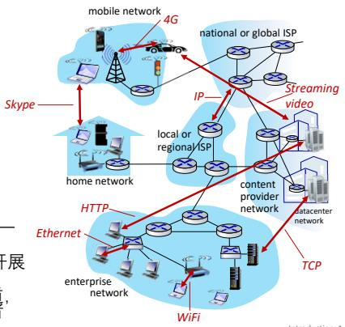

## 服务描述

 基础设施： 为应用程序提供服务

• 大量的应用 ： Web, 流媒体, 多媒体电话会议 邮件 游戏 电子商务, 社交媒体, 互联电器, …

 编程接口： 为分布式应用程序提供编程接口 :

• 允许发送/接收应用 "连接" 、 使用 互联网传输服务的"挂钩"

• 提供类似于邮政服务的服务选项

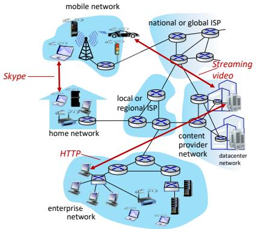

## Cha pte r 1 : 内 容

 什么是因特网 ?

 什么是协议?

网络边缘: 主机 接入网络 物理媒体

 网络核心: 分组/电路交换, 网络结构

 性能: 丢包, 时延, 吞吐量

 网 络安全

 协议层次, 服务模型

 计算机网络的历史

## 因特网的结构

网 络边缘 N etwo rk edge :

 端系统 （也称为主机）

• 主 机 ： 客户 c l i e n ts 和 服务器 s e rve rs

• 服务器 ： 通常在数据中心

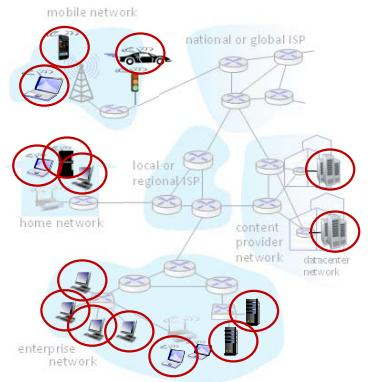

## 接入网络和物理媒体

Q:如何连接端系统和边缘路由器?

 家庭接入

 无线接入 (W i F i, 4G/5 G/6G )

 企业接入 (学校, 公司 )

## 选择接入网时主要考虑什么？

 接入网 带宽?

 共享或专用?

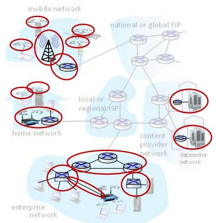

## 家庭接入 ： 电缆接入网

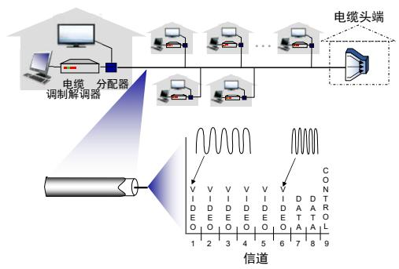  
频分复用(FDM):不同的信道在不同的频带中传输

## 家庭接入网

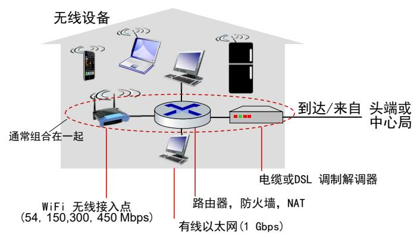

## 无线接入网

共享无线接入网 - 连接端系统到边缘路由器

无 线本 地 网 络 W i re l e ss l o ca l a re an etwo r ks (W LAN s)

 室 内 ( \~3 0米 )

802 . 1 1 b/g/n (W i F i ) : 1 1, 54,45 0 M b ps 传 输速率

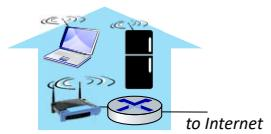

广域蜂窝接入 网 络 Wi d e-a reace l l u l a r a cce ss n etwo r ks

 通过基站 （也称为接入点）

 4G 、 5G (6G ) 网 络

 由移动 蜂窝网络运营商提供(10’sk m )

 \~ 10 M 、 \~25 M b ps 平均 上传 带 宽

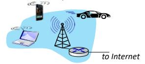

## 物理链路

同 轴 电缆Coaxi a l ca b l e :

 两个同心的铜导体

 双 向

 宽 带 :

• 多频通道

• 单通道 100 M b ps

光纤 F i b e r o pt i c ca b l e :

携带光脉冲的玻璃纤维 每个脉冲表示1比特

 高速运行:

• 高速点对点传输( 10- 100 G b ps)

 错误率低:

• 中继器相距远

• 抗电磁噪声干扰

## 物理链路

无线 电W i r e l e s s r ad i o

 电磁频谱中的信号

 不需要物理线路

 双向依赖传播环境和距离

• 反 射

• 遮挡衰落

• 干扰

无线电链路类型 :

 地面微波

• 45 Mb p s \~ 1 0G b p s

 局 域 (W i F i )

• 1 00 Mb p s \~9G b p s

 广 域 ( e . g . , 蜂 窝 )

• 4G : 1 00Mb p s

• 5G : 20G b p s

 卫星

• 单通道50\~ 1 50Mb p s

同 步卫星250\~500 ms ec 端 到端延迟

• 同步卫星和近地轨道卫星

## 分组交换 ： 存储转发

 传输延迟Tra n s m i ss i o n d e l ay ： 需要 L/R 秒 才能将 L 位分组传输到 R bps 的链路中

 存储转发Store and forward ： 整个分组必须到 达路由器才能在下一个链路上传输

上 图 中 的 端端延迟End-end delay: 2 L/R ， 假设零传播时延

## 一跳的传输时延:

 L = 1 0 K b i ts

 R = 1 00 M b p s

 一跳的传输时延 = 0 . 1 m sec

## 分组交换 ： 排队时延和分组丢失

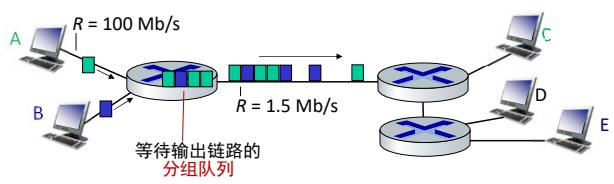

分组排队和丢失 Packet queuing and loss: 一段 时 间 内链路中的到达速率大于链路的发送速率

 分组排队, 等待从输出链路发送

 如果路由器中的缓存空间已填满， 则到达的分组或已经排队的分组之一将被丢弃

## 电路交换中 的复用

## 频分复用

F re q u e n cy D ivi s i o n M u l t i p l ex i n g ( F D M )

 划分频率为不同的频段

 每条连接专用一个频段 可以以该（窄） 频段的最大速率传输

 每条电路连续地得到部分带宽

## 时分复用

Ti m e D ivi s i o n M u lt i p l exi n g (TD M )

 划分时间为固定期间的帧 每个帧被划分为固定数量的时隙

 每条电路专用每个帧中的指定时隙。 可以以最大 （更宽） 频段的速度传输 但仅在其时隙期间

 每条电路在短时间间隔 （即时隙） 中周期性地得到所有带宽

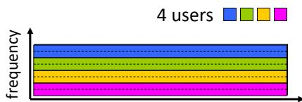

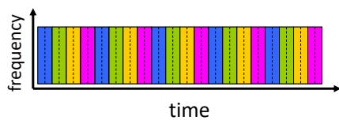

## 分组交换与电路交换的对比

分组交换允许更多用户使用网络！

## 列 子 :

 1 Gb/s 的 链路

 每个用户 :

• 用 户 活动 时速率 ： 1 00 Mb/s

• 活动时间比例 ： 1 0%

Q : 电路交换和分组交换链路分别能支持多少个并发用户 ？

 电路交换: 1 0 个用户

 分组交换: 35个用户 超过1 0个用户 （1 1 个用户或更多的用户 ）同时活动的概率为 0. 0004 \*

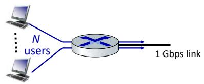

Q: 如 何计算得到 0 . 0004?

Q: 用户数大于35会怎样 ?作链路繁忙的概率随该用户数变化的曲线

## 网络结构 ： 网络的网络

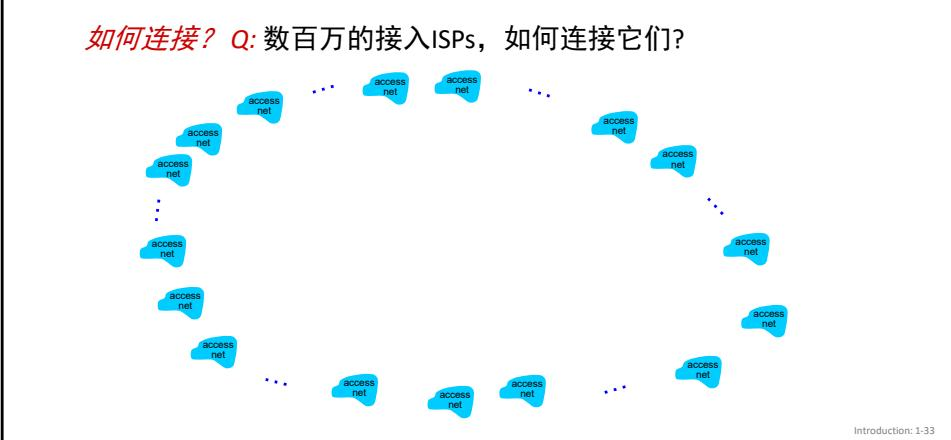

## 网络结构 ： 网络的网络

如何连接？ Question:数百万的接入ISP 如何连接他们??

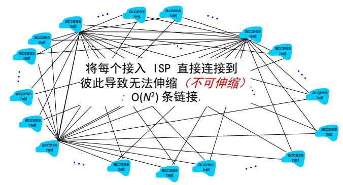

## 网络结构 ： 网络的网络

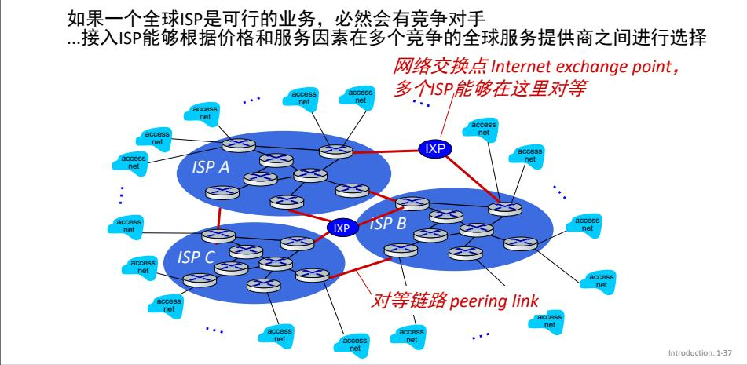

## 网络结构 ： 网络的网络

…还会出现区域网络服务提供商 （ reg i ona l I SPs） ， 将接入网络连接到全球传输 I SPs

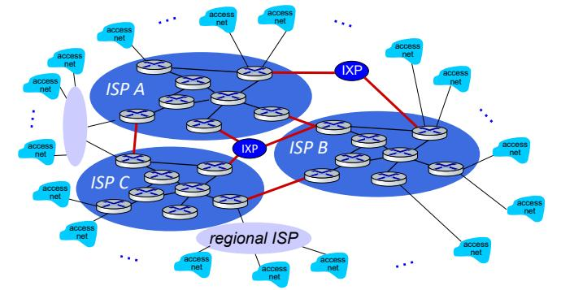

## 第 一层 I SP 网 络地 图 : Sp r i nt (20 1 9)

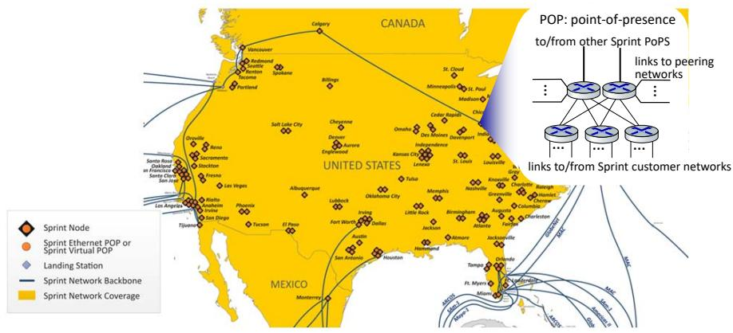

## Cha pte r 1 : 内 容

 什么是因特网?

 什么是协议?

 网络边缘: 主机 接入网络 物理媒体

 网络核心: 分组/电路交换 网络结构

 性能 : 丢包, 时延, 吞吐量

 网 络安全

 协议层次, 服务模型

 计算机网络的历史

## 分组的四种时延

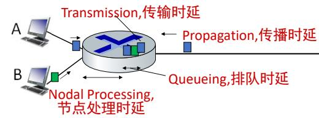

$$
d _ { \mathsf { n o d a l } } = d _ { \mathsf { p r o c } } + d _ { \mathsf { q u e u e } } + d _ { \mathsf { t r a n s } } + \ d _ { \mathsf { p r o p } }
$$

d : 传输时延 :

 L : 分组 长 度 ( b i t s )

dp ro p : 传 播 时 延 :

 R : 链路带 宽 ( b ps)

 d: 物理链路的长度

 dtrans = L/R

 s : 传 播速度 ( 2x 108 \~3x 108 m/sec)

d = d/s p ro p

dt ra n s a n d dp ro p very d i ffe re n t

## 传输和传播时延的类比

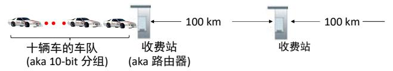

 车 以 1 00 km/h r " 传播 "

收费站服务车需要 1 2 秒 (b i t传输时间)

 车 \~ b i t ; 车 队 \~ 分组

 Q: 需要多久车队才能到达第二个收费站?

整个车队通过收费站到高速公路上 的 时 间= 1 2\*1 0 =1 20 s ec

最后一辆车从第一个收费站“传播” 到第二收费所需时间 : 1 00 km/ ( 1 00 km/h r ) = 1h r

 A: 62 m i n ut e s

## 真实的网络时延和路由是怎样的 ？

 真实的网络时延和丢失是怎样的 ？

t r ace r o ut e （ t r ace r t ） 程序 : 提供 分组从源到 目 的 路径 上所经过的所有路由器的时延测量. 对于所有的 i:

向经过路由器 i到 目 的路径上发送三个分组 (分组的生存时间字段设为 i)

• 路由器 i 会给发送者返回报文

• 发送者测量发送和回复之间的时间间隔

## 真实的网络时延和路由是怎样的 ？“Rea l” I nte rnet De lays a nd Routest ra ce ro u te : ga i a . cs . u m a ss . e d u to www. e u re co m .fr

3 d e l ay m ea s u re m e nts fro m ga i a . cs . u m a ss . e d u to cs-gw. cs . u m a ss . e d u

2 b o rd e r 1 - rt-fa 5- 1 -0 . gw. u m ass . e d u ( 1 2 8 . 1 1 9 . 3 . 1 4 5 ) 1 m s 1 m s 2 m s 3 cht-vbns . gw. u m ass . ed u ( 1 28 . 1 1 9 . 3 . 1 30) 6 m s 5 m s 5 m s 1 cs-gw ( 1 28 . 1 1 9 . 240 . 254) 1 m s 1 m s 2 m s 3de to b   
4 j n 1 -at 1 - 0 - 0 - 1 9 . wo r. v b n s . n et (2 04 . 1 4 7 . 1 3 2 . 1 2 9 ) 1 6 m s 1 1 m s 1 3 m s   
5 j n 1 -so7-0-0-0 .wae . vbns . n et (204 . 1 47 . 1 36 . 1 36) 2 1 m s 1 8 m s 1 8 m s   
6 abi lene-vbns . abi lene . u caid . ed u ( 1 98 . 32 . 1 1 . 9) 22 m s 1 8 m s 22 m s   
nycm -wash . abi lene . ucaid . ed u ( 1 98 . 32 . 8 .46) 22 m s 22 m s 22 m s t ra n   
8 62 .40 . 1 03 . 253 (62 .40 . 1 03 . 253) 1 04 ms 1 09 ms 1 06 ms   
9 d e2- 1 . d e 1 . d e . g ea nt . n et (62 . 40 . 96 . 1 2 9 ) 1 09 m s 1 02 m s 1 04 m s   
1 0 d e . fr 1 . fr. g e a n t . n et ( 6 2 . 4 0 . 9 6 . 5 0 ) 1 1 3 m s 1 2 1 m s 1 1 4 m s   
1 1 re n ate r-gw. fr 1 . fr. g e a n t . n et ( 6 2 . 4 0 . 1 0 3 . 54 ) 1 1 2 m s 1 1 4 m s 1 1 2 m s   
1 2 n i o- n 2 . css i . re n ate r. fr ( 1 9 3 . 5 1 . 2 0 6 . 1 3 ) 1 1 1 m s 1 1 4 m s 1 1 6 m s   
1 3 n ice . cssi . renater.fr ( 1 95 . 220 . 98 . 1 02 ) 1 23 m s 1 25 m s 1 24 m s   
1 4 r3t2 - n i ce . css i . re n ate r. fr ( 1 9 5 . 2 2 0 . 9 8 . 1 1 0 ) 1 2 6 m s 1 2 6 m s 1 24 m s   
1 5 eu recom-val bon ne r3t2 ft net ( 1 93 48 50 54) 1 35 ms 1 28 ms 1 33 ms   
1 6 1 94 . 2 1 4 . 2 1 1 . 2 5 ( 1 94 . 2 1 4 . 2 1 1 . 2 5 ) 1 2 6 m s 1 2 8 m s 1 2 6 m s   
1 7 \* \* \*

3 d e l ay m e a s u re m e nts

o rd e r 1- rt-fa 5 - 1-0 . gw. u m a ss . e d u

s-o ce a n i c l i n k

l o o ks l i ke d e l ays decrease ! W hy?

1 8 \* \* \* \* m e a n s n o re s p o n s e ( p ro b e l o st, ro u te r n ot re p l y i n g )   
1 9 fa n tas i a . e u re co m . fr ( 1 9 3 . 5 5 . 1 1 3 . 1 42 ) 1 32 m s 1 2 8 m s 1 3 6 ms

\* D o so m e t ra ce ro u te s fro m exot i c co u nt ri e s at www.t ra ce ro u te . o rg

## 吞吐量 Th rough put

$R _ { s } < R _ { c }$ 平均端到端吞吐量是?

$R _ { s } > R _ { c }$ 平均端到端吞吐量是?

瓶颈链路

bottleneck link

路径上的链路限制 了端到端的吞吐量

## 吞吐量 ： 因特网场景

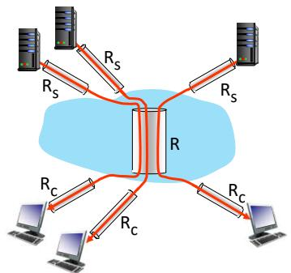  
1 0 co n n e ct i o n s (fa i r l y) s h a re b a c k b o n e b ott l e n e c k l i n k R b its/se c

 每条连接端到端吞吐量: $m i n ( R _ { c } , R _ { s } , R / 1 0 )$

 实际上: $R _ { c } \circ \Upsilon R _ { s }$ 往往是瓶颈

\* C h eck out th e o n l i n e i nte ractive exe rcises for m o re exa m p l es : http ://ga ia cs u mass ed u/ku rose ross/

## 坏人:通过互联网将恶意软件投放到主机

 恶意软件入侵主机的形式:

• 病毒virus: 需要某种形式的用户交互来感染用户设备的恶意软件 ( e . g . , e - m a i l a tta c h m e n t )

• 蠕虫worm: 无须任何明显用户交互就能进入设备的恶意软件

间谍软件spyware、 恶意软件malware可以记录击键， 访问网站，上传信息到收集网站

 受感染的主机可以注册僵尸网络 用于垃圾邮件或分布式拒绝服务 （ D DoS ） 攻击

## 坏人： 攻击服务器、 网络基础设施

拒绝服务Denial of Service (DoS):攻击者通过具有虚假流量的压倒性资源使服务 （服务器、 带宽） 无法被合法访问

1 . 选择 目标

2. 入侵网络周 围的主机(组建僵尸网络)

3 从被攻陷的主机发送分组包到 目标

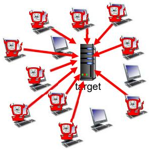

## Cha pte r 1 : 内 容

 ·什么是因特网?

 什么是协议?

 网络边缘: 主机 接入网络 物理媒体

 网络核心: 分组/电路交换 网络结构

 性能: 丢包 时延 吞吐量

 网络安全

 协议层次, 服务模型

 计算机网络的历史

网络很复杂，有很多 “组件"：

 主机

 路由器

## 协议分层和参考模型

 应 用

 各种媒体链路

 协 议

是否我们可以组织或者管理网络结构?

…或者我们每个人要编写网络或者使用 网络都要知道所有这些?

 硬件 软件

## 为何要分层 ？

处理复杂的系统:

分层的体系结构有利于复杂系统组件的联系和识别

• 分层的参考模型

• 模块化便于系统的维护、 更新

• 每一层服务实施上的变化 ： 对系统其余部分透明

• e. g. 登机程序的更改不会影响航线系统的其余部分

分层被认为是不利的?

在其他复杂系统中分层体系结构?

## 网络协议栈

应用层 application: 支持 网 络应 用• I M A P, S MTP, HTTP

 传输层transport: 处理数据传输• TCP U D P

网络层network: 完成数据报从源到 目  
的的路由IP 路中协议

• I P, 路 由 协议

 数据链路层link:相邻网络元素之间的数据传输

• Et h e r n et, 8 0 2 . 1 1 ( W i F i ) , P P P

 物理层physical: b its “o n t h e w i re”

## 因特网的历史

## 1961 -1972: 早期的分组交换原则

 1 9 6 1排 队论 : K l e i n roc k 发 表 ：排队理论显示分组交换的有效性

 1964分组交换: 兰德公司 的 Baran研究 ： -军用网中的分组交换

 1967美国高级研究计划署的计算机科学计划ARPAnet-第一个分组交换计算机网络（ Robert 1967 ）

1969第1台分组交换机在美国加州大学洛杉矶分校UCLA安装 其他3台分组交换机安装于斯坦福研究所SRI 、 美国加州大学圣巴巴拉分校 U C Sa nta Ba rba ra 、 犹 他大 学 U n ive rs ity ofUtah。 年底有四个节点。 第一个应用是从UCLA到SRI的远程注册 （导致 了系统的崩溃）

 1972 AR PAn et成长 到 有 15个节 点 :

• ARPAnet进行 了 公开演示

• 第一个主机-主机协议N C P ( N etwo r k Co nt ro l P rotoco l )

• 第一个电子邮件程序

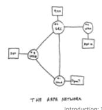

## 因特网的历史

1972-1980:专用网络和网络互联

 1970 夏威夷岛上的微波网络

 1974 网 络 的 网 络 : Ce rf a n d Ka h n-互连网络架构

 1976共享广播网络的以太网协 议 : Et h e rn et at Xe rox PA RC

 l ate70’s专 用 网 络体系结构 :D EC n et, S N A, X N A

 l ate 70’s : 交换 固 定 长 度 分组(ATM前身)

 1979 : AR PAn et有 200个节 点

Vi nt Cerf 与 Bob Ka h n - 互 联 网 之父

Ce rf a nd Ka h n’s 开放 网 络体系结构的系统设计原则:

最简单化 自治原则-网络独立运作， 与其他网络互连时无须进行内部改动

 尽最大努力服务模式

 无状态路由

 分散控制 ■

定义当今互联网架构

## 因特网的历史

2005-present:更多的新应用 互联网"无处不在"

\~1 80亿连接到 因特网 的设备 (201 7)• 智 能 手机 的 崛起 ( i Phone : 2007)

宽带接入的积极部署

 提高高速无线接入的普及程度 ： 4G/5G/6G 无线网络

在线社交网络的出现：

Facebook : \~25亿 用 户

 服 务提供 商 (Goog l e FB M i c r o soft) 创 建 自 己 的 网 络

• 绕过商业互联网 “紧密” 连接到终端用户 ， 提供"即时"访问搜索， 视频内容，…

企 业 在 " 云 " 中 运 行 其 服 务 ( e . g . , Am a zo n We b Se rvi ces, M i c rosoft Az u re )

## Cha pte r 1 : 总 结

主要内容

 网络简介

 协议

网络边缘和网络核心

• 分组交换与电路交换

• 网络结构

 性能: 丢失 延迟 吞吐量

 网络分层和服务模型

 网络安全

 计算机网络的历史

## 你学习到:

 网络概览 网络领域的术语等

初步感受到网络互联