## 1、针对docvqa现有数据提问

重点检查：答案是否正确、回答的引用里是否显式带出页码和图号，~~~~并且citation能够定位到对应数据。

1. `在当前 unique-docpage-100 测试集里，针对 docvqa 样本 10269，请只回答最终答案，并在答案中标出引用：What is the Fax Number ?`

期望答案：`(503)786-4930`

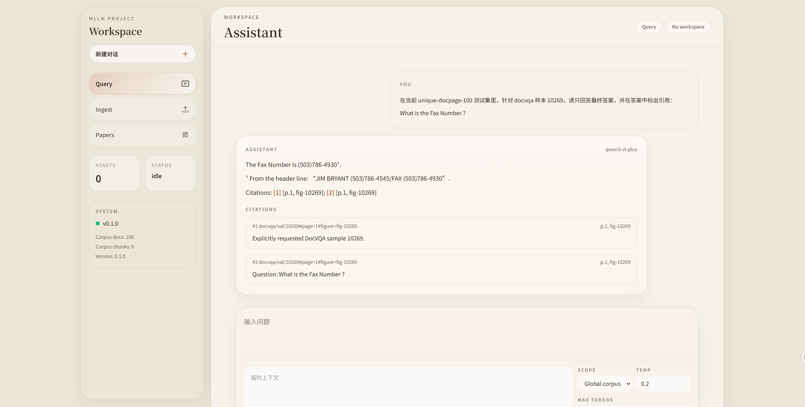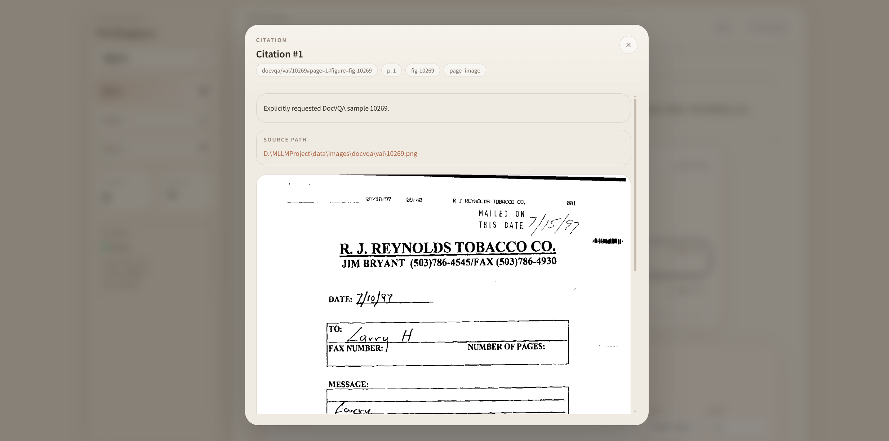

2. `在当前 unique-docpage-100 测试集里，针对 docvqa 样本 11333，请只回答最终答案，并在答案中标出引用：what is J.O number?`

期望答案：`3088`

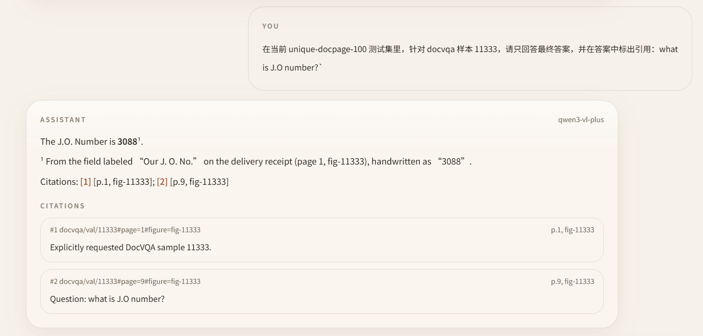

3. `在当前 unique-docpage-100 测试集里，针对 docvqa 样本 18611，请只回答最终答案，并在答案中标出引用：What is the PD ?`

期望答案：`5954 B`

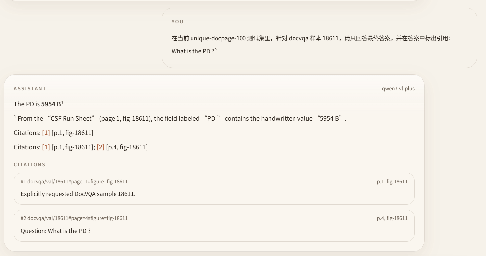

4. `在当前 unique-docpage-100 测试集里，针对 docvqa 样本 15330，请只回答最终答案，并在答案中标出引用：What is the tagline of classmate?`

期望答案：`BECAUSE YOU ARE ONE OF A KIND`

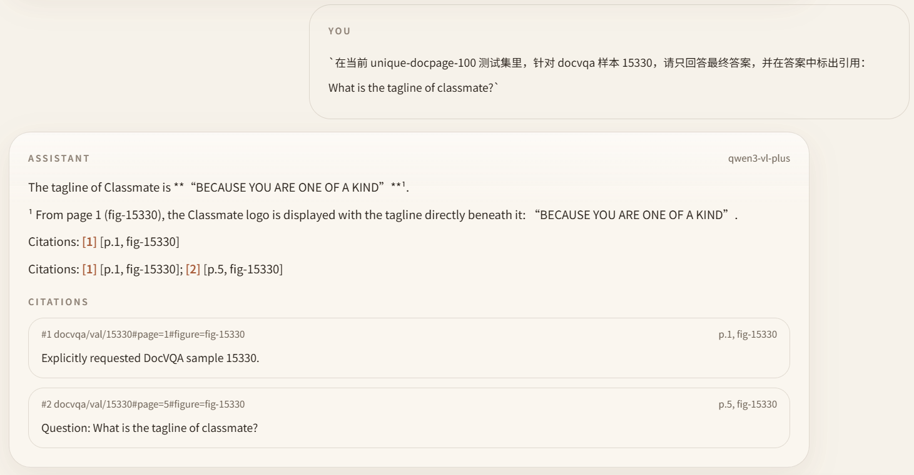

5. `在当前 unique-docpage-100 测试集里，针对 docvqa 样本 4369，请只回答最终答案，并在答案中标出引用：What is written on the pack?`

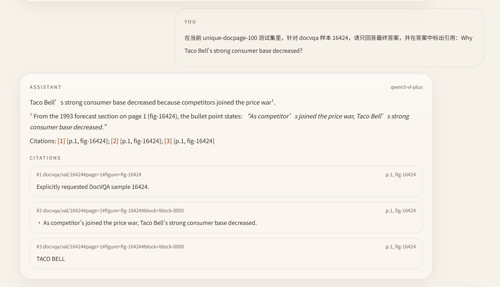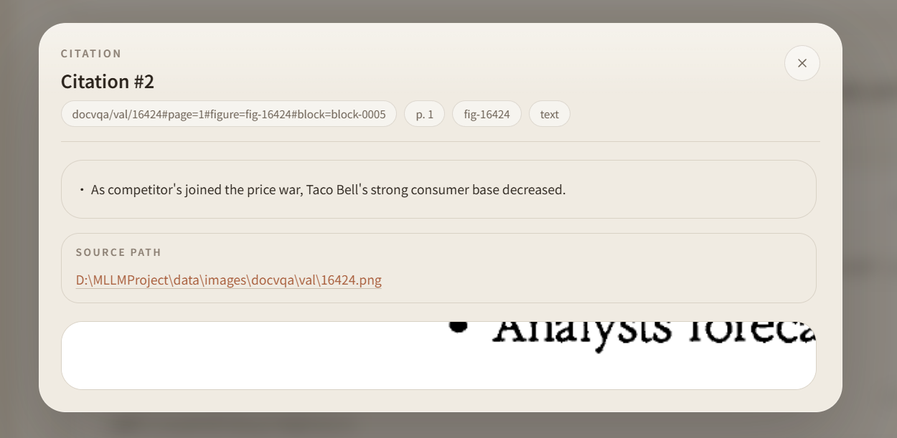

## 2、针对自定义的文件创建工作区

测试文件是信息安全相关课程课件与笔记，包含：pdf、md、图片。

- 密码学Hash的安全性有哪些？（定位到C5-数字签名）

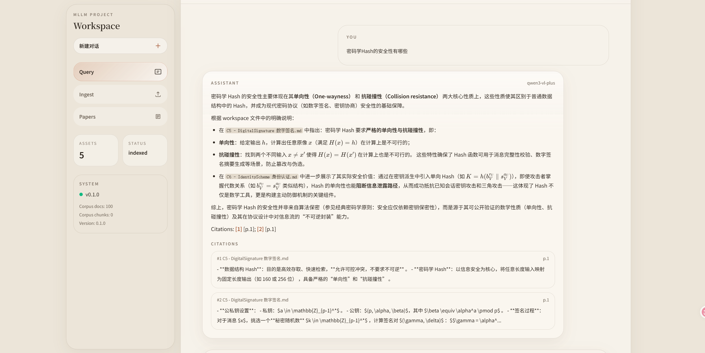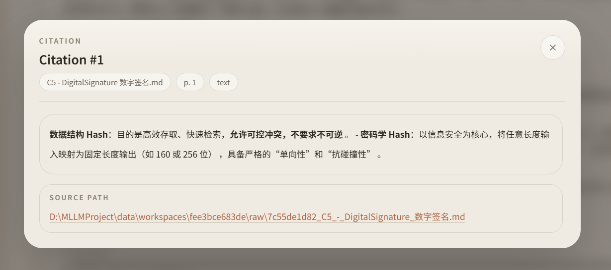

- 解释基于身份的加密IBE中 Boneh-Frankline IBE方案

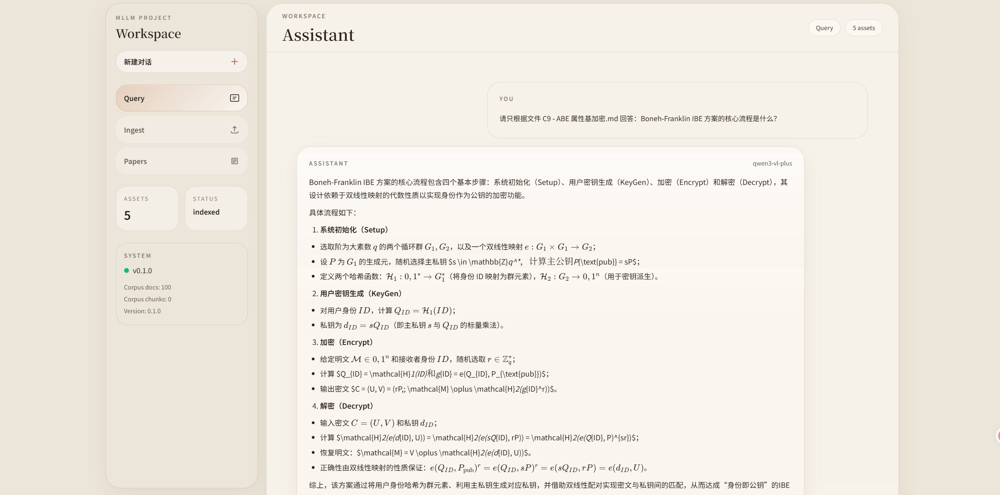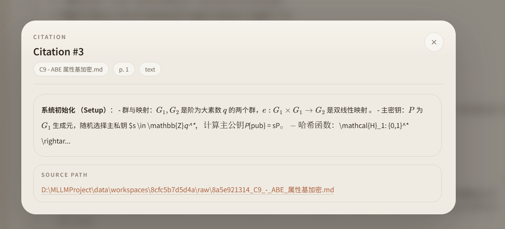

- 2-ClassicCryto这份课件的内容提要一页中内容是什么？

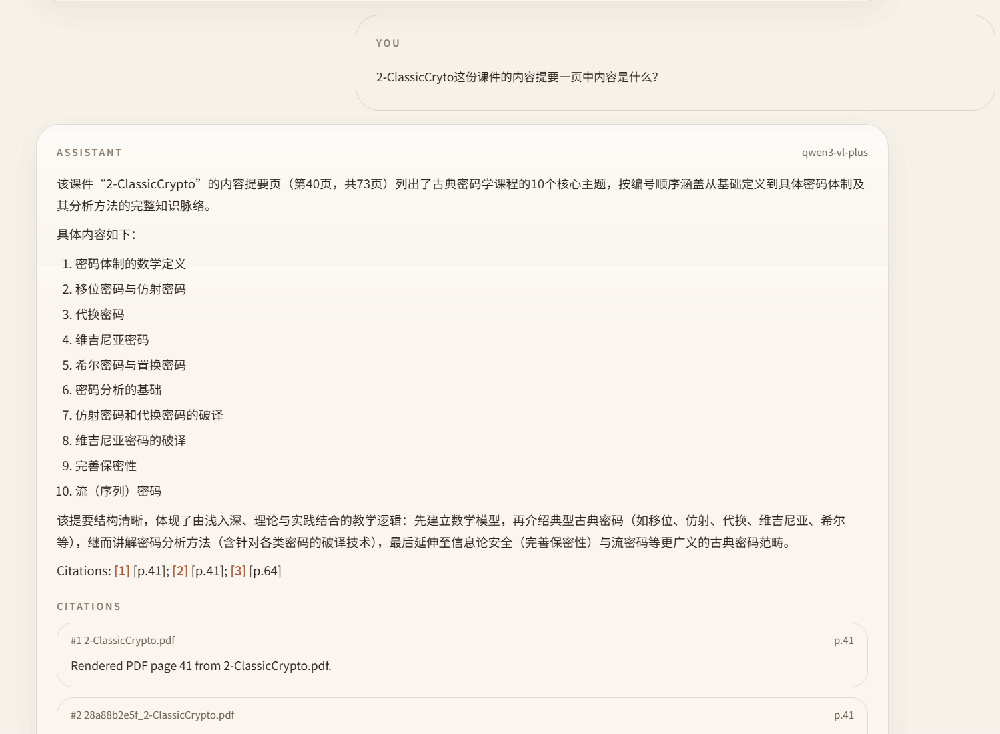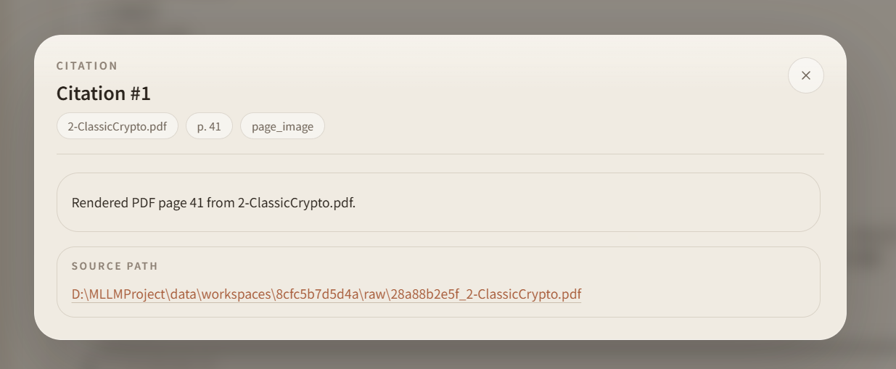

- 2-ClassicCryto这份课件关于密码体制的数学定义在哪一页？

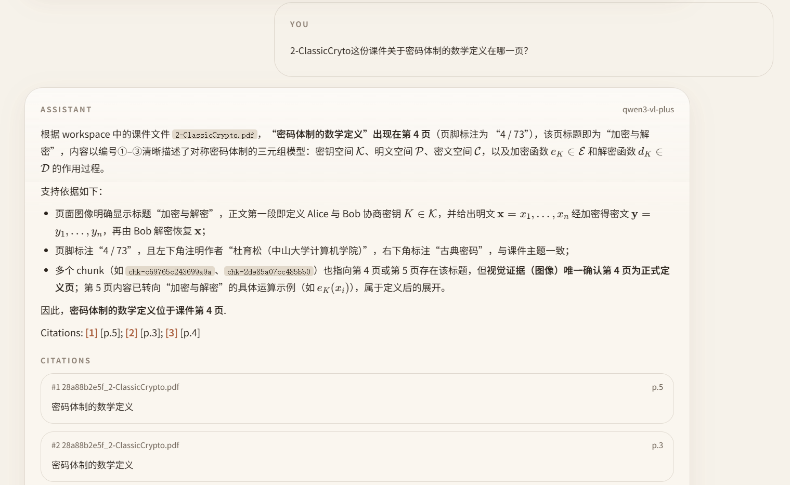

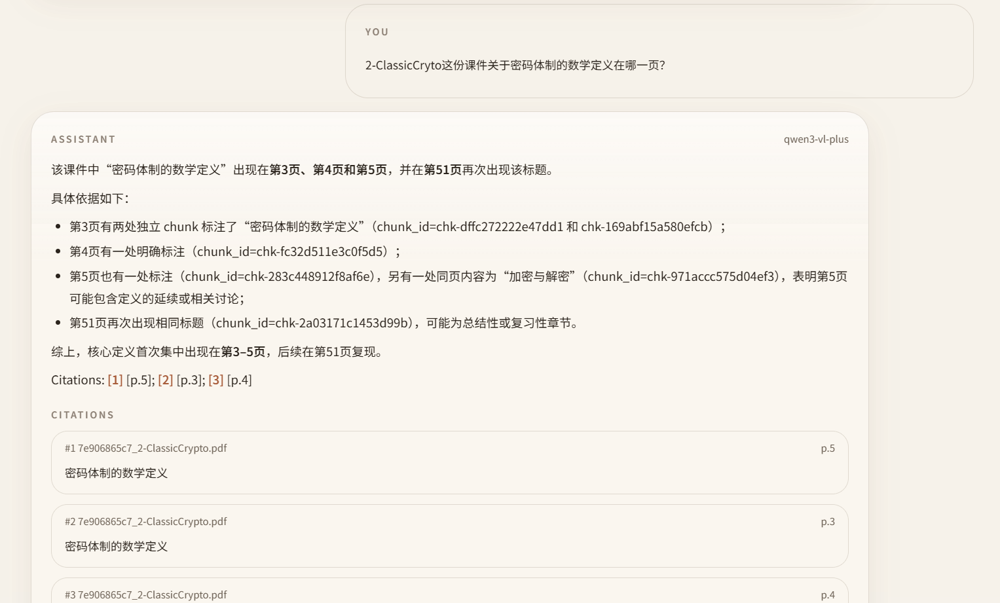

- 身份认证因子有哪些？

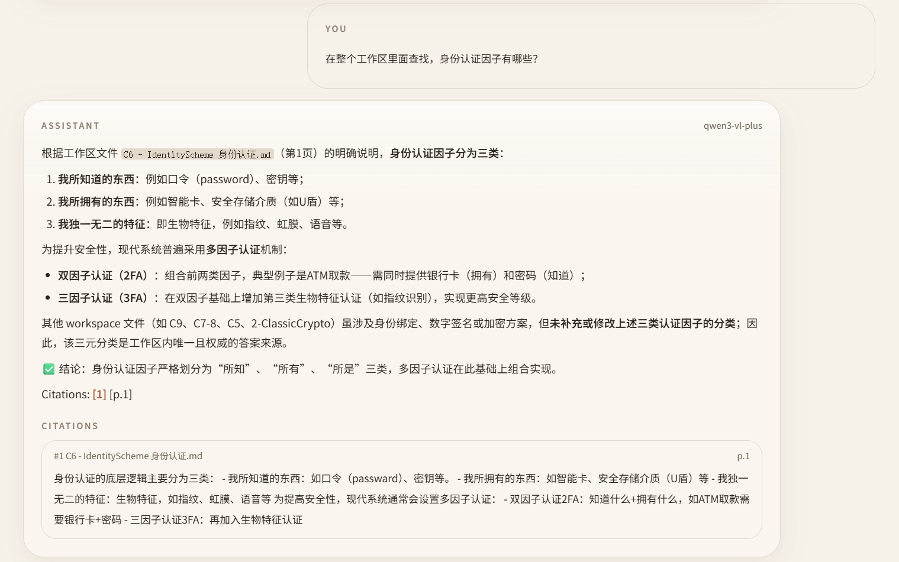
