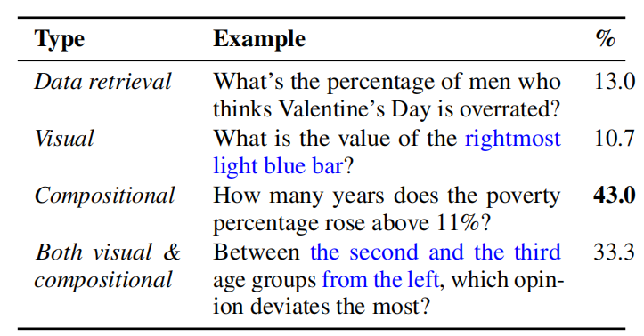

## 多模态课程大作业-开题报告
#### 一、任务背景
##### 1.1 应用背景
在实际学习过程中，课程讲义与PPT通常包含大量文本、图表、公式及结构化信息，呈现出复杂的视觉排版特征。在期末复习阶段，学生往往需要频繁在不同页面中查找关键知识点，效率较低。
现有基于关键词或文本匹配的检索方法主要依赖纯文本信息，存在两个核心局限：（1）难以处理图表、公式、布局结构等视觉内容，导致信息丢失；（2）无法利用文档的空间布局语义（如标题层级、栏位关系、图文位置关联）进行跨模态推理，因此难以满足复杂文档理解与问答的需求。
随着多模态大模型（Vision-Language Models, VLM）的发展，模型能够同时理解视觉与语言信息，为文档理解任务提供了新的解决方案。然而，直接将整本教材或讲义输入VLM存在上下文长度限制和计算成本问题；而传统的检索增强生成（RAG）框架又往往忽略文档的视觉布局信息。因此，**结合文档结构感知的多模态建模与检索增强生成框架，构建智能文档问答系统**具有重要研究与实际应用价值。

##### 1.2 核心任务
本项目旨在构建一个面向课程文档（如PDF讲义、PPT截图）的多模态智能问答系统。
系统需要完成以下核心任务：
* 文档结构化解析：对文档进行版面分析，提取文本、表格、图像及布局位置信息
* 多模态索引构建：支持文本、图表、公式的多模态分块与向量化索引
* 自然语言问答：支持自然语言问题输入，结合检索与多模态理解生成答案
* 可追溯引用：在回答中提供可追溯引用（页码或图号）
此外，系统旨在同时具备图表和复杂数学公式的理解、推理能力，能够回答如 “图3表示什么趋势” “公式中的变量具有的实际含义” 等跨模态问题。

##### 1.3 预期目标
本项目的预期目标包括：

**（1）功能目标**
* 支持多页PDF文档上传与解析
* 实现文本、图表的多模态分块与索引
* 支持自然语言问答并返回带引用答案

**（2）性能目标**
* 在DocVQA子集上达到可用准确率（如 ≥60%）
* 多模态RAG相较纯文本RAG有明显提升（≥10%）

**（3）分析目标**
* 对系统错误进行分析（OCR错误、检索错误、模型幻觉）
* 对比不同方法性能差异

 ---

#### 二、相关工作
##### 2.1 VLM
- Qwen-VL
- InternVL

实验结果：
- Qwen3-VL-8B-Instruct
    - DocVQA 96.1 [DocVQA](https://www.datalearner.com/benchmarks/doc-vqa)
- Qwen3-VL-4B-Instruct
    - DocVQA 95.3 [DocVQA](https://www.datalearner.com/benchmarks/doc-vqa)
 
上述结果表明，VLM 已具备较强的单页文档理解能力。本项目的核心挑战在于**如何将 VLM 的能力扩展至多页、多模态检索增强的问答场景**，而非简单的单页端到端推理。


##### 2.2 检索增强生成（RAG）
采用双路 RAG + 晚融合。具体流程为
1. 数据预处理与索引
    - 文本方面：对所有文档进行OCR，将提取出的文本分割成块，用文本嵌入模型索引。
    - 视觉方面：将所有文档页面视为图片，用视觉语言模型为每一页生成嵌入向量，建立索引。
2. 并行单模态RAG,下面是并行的两条线，都采用三步提示策略：
    - 视觉RAG管道：视觉检索器根据问题检索相关页面 → 大模型收到问题+页面图片 → 执行①证据筛选、②思维链推理、③生成答案。
    - 文本RAG管道：文本检索器根据问题检索相关文本块 → 大模型收到问题+文本 → 执行①证据筛选、②思维链推理、③生成答案。
3. 模态融合

将上一步得出的两条推理链和答案交给LLM，LLM会分析二者的一致性（如是否存在矛盾），进行调和，最终生成一个融合了图文信息的最终答案。也就是说，最后的 LLM 整合的是两条通路思维链，而不是初始召回的数据。

上面的整体思路是参考 [VisDoM: Multi-Document QA with Visually Rich Elements Using Multimodal Retrieval-Augmented Generation](https://aclanthology.org/2025.naacl-long.310/)，该论文表明双路 RAG 比纯视觉嵌入的 Visual RAG 更优。以ChatGPT4o 为例，在 PaperTab 的平均得分表现为：
    - Visual RAG (仅视觉)：42.01
    - VisDoMRAG (视觉+文本融合)：44.11

而视觉 RAG 这条通路，参考 [VisRAG: Vision-based Retrieval-augmented Generation on Multi-modality Documents](https://arxiv.org/abs/2410.10594)，具体步骤如下：
1. 查询与文档的嵌入表示。VisRAG-Ret (检索器)接收一个文本查询和一张文档页面图像，分别输出一个单一的向量表示：
    - 查询向量 (v_q)：对文本查询的语义理解。
    - 文档向量 (v_d)：对文档页面图像的整体视觉和语义理解。
2. 检索与相似度计算。系统通过计算 v_q 和 v_d 的余弦相似度来判断文档与查询的相关性：`s(q, d) = cos(v_q, v_d)`。
3. 多文档视觉生成。对于检索返回的多张图片 D_R = {d_1, d_2, ..., d_k}，VisRAG-Gen（生成器）提供了三种处理方式：
    - 页面拼接：将Top-K个页面横向拼接成一张长图，输入给只支持单图的VLM。
    - 加权选择：让VLM根据每张图单独生成一个答案，再用检索相似度作为权重，选出最终答案。
    - 多图输入：直接交给支持多图理解的VLM（如MiniCPM-V 2.6），让模型自行跨页面推理。

需要注意，上面提到的 VisRAG-Ret 和 VisRAG-Gen 均为双塔模型，而不是 Bert。

- 向量库：ChromeDB 本地轻量级
- RAG 框架：LlamaIndex
- Text embedding Model：[harrier-oss-v1-270](https://huggingface.co/microsoft/harrier-oss-v1-270m) 或 [harrier-oss-v1-0.6b](https://huggingface.co/microsoft/harrier-oss-v1-0.6b)，参考 [MTEB](https://huggingface.co/spaces/mteb/leaderboard) 中 Retrieval Metric
- Image embedding Model：[Qwen3-VL-Embedding-2B](https://huggingface.co/Qwen/Qwen3-VL-Embedding-2B)，参考 [MMEB-Leaderboard](https://huggingface.co/spaces/TIGER-Lab/MMEB-Leaderboard)。或者，也可以仿照 VisRAG，使用 MiniCPM-V 2.6 做复现。


##### 2.3 文档结构感知与多模态表征
参考论文 [\[LayoutLMv3: Pre-training for Document AI with Unified Text and Image Masking](https://arxiv.org/abs/2204.08387)

文档理解的核心挑战在于如何有效建模**文本、图像与二维布局结构**的联合表征。LayoutLMv3 [Huang et al., ACM MM 2022] 提出了一种统一的文档预训练框架，通过三项关键创新解决了此前工作中文本与图像预训练目标粒度不一致的问题：

**（1）无 CNN 的轻量化视觉编码**。LayoutLMv3 摒弃了此前 Document AI 模型对 CNN 或 Faster R-CNN 的依赖，受 ViT 和 ViLT 启发，直接使用**线性投影的图像 Patch** 作为视觉输入。这一设计将图像嵌入的参数量从 44M（ResNet-101）降至 **0.6M**，显著降低了计算开销，同时消除了对区域标注（Region Annotation）的依赖，为资源受限场景下的文档理解提供了可行路径。

**（2）统一离散 Token 重建目标**。此前工作存在文本与图像预训练目标粒度不一致的问题——文本使用 MLM（预测离散 Word Token），图像使用像素重建或区域特征回归（连续信号），导致跨模态对齐学习困难。LayoutLMv3 创新性地引入 **Masked Image Modeling（MIM）**，将图像 Patch 通过离散 VAE 编码为视觉词表中的离散 Token，使图像侧目标与文本侧 MLM 在相同的"离散分类"粒度上进行对称学习。

**（3）词-块对齐（Word-Patch Alignment, WPA）**。利用文档中文字与图像区域天然的显式对应关系，LayoutLMv3 设计 WPA 目标：预测某文本词对应的图像 Patch 是否被掩码，强制模型学习细粒度的图文空间关联。消融实验表明，WPA 相比无 WPA 的基线（Model #3）带来一致提升：

| 任务     | 数据集   | 无 WPA    | 有 WPA        | 提升  |
| :------- | :------- | :-------- | :------------ | :---- |
| 表单理解 | FUNSD    | F1 89.19  | **F1 89.78**  | +0.59 |
| 收据理解 | CORD     | F1 96.30  | **F1 96.49**  | +0.19 |
| 文档分类 | RVL-CDIP | Acc 95.42 | **Acc 95.53** | +0.11 |

在 DocVQA 基准上，LayoutLMv3_BASE 以 **133M 参数**取得 ANLS **78.76**，超过此前 **200M 参数**的 LayoutLMv2_BASE（ANLS 78.08），验证了布局感知的联合表征对文档级多模态推理的显著价值。

**与本项目的关联**：LayoutLMv3 的工作为本项目的**文档解析与分块模块**提供了核心理论启发。课程讲义常涉及双栏排版、图文混排和表格嵌套，若仅依赖 OCR 提取纯文本，会彻底丢失栏位关系和图文对应线索。LayoutLMv3 的结论表明，**文档不是纯文本序列，而是具有二维空间结构的视觉对象**，结构化解析必须同时利用文本内容、视觉外观和布局位置信息。此外，其"无 CNN"的轻量化设计思路也指导我们在文档解析阶段优先选择基于 Transformer 的解析方案（如 MinerU），避免引入过重的检测网络，在单卡 24GB 显存预算下为后续的 VLM 推理和向量检索预留足够资源。


##### 2.4 多模态文档检索增强生成
参考论文 [M3DocRAG: Multi-modal Retrieval is What You Need for Multi-page Multi-document Understanding](https://arxiv.org/abs/2411.04952)

传统的检索增强生成框架主要依赖文本检索，即通过 OCR 提取文档文字后建立文本索引。但在实际应用中，许多问题的答案信息存在于图表、示意图、公式等非文本模态中，文本检索无法有效处理这些视觉证据，导致答案召回失败和生成质量下降。因此，**保留视觉信息的多模态检索**成为近年来文档理解领域的重要研究方向。

Cho 等人提出的 M3DocRAG 是面向多页多文档场景的多模态 RAG 代表框架，采用**三阶段流水线**：

**（1）文档嵌入阶段**：将所有 PDF 页面转换为 RGB 图像，使用 **ColPali**（基于 Late Interaction 机制的多模态检索模型）对每页提取视觉嵌入表示。与传统单向量嵌入（如 CLIP-style dual encoder）不同，ColPali 为每个页面保留 **Token 级别的细粒度特征**（multi-vector representation），通过 MaxSim 算子计算查询 token 与文档 token 之间的最大相似度之和，实现更精准的局部语义匹配——这对于文档问答尤为重要，因为查询中的特定术语（如"图3"、"公式中的 α"）需要与页面中的局部区域精准对应。

**（2）页面检索阶段**：通过 MaxSim 算子计算文本查询与页面图像的细粒度相似度，检索 Top-K 相关页面。在开放域场景下，利用 Faiss **IVF 近似索引**将检索延迟从 20 秒/查询降至 **2 秒以内**，在速度与精度间取得良好平衡。

**（3）视觉问答阶段**：将检索到的 Top-K 页面图像与文本查询一同输入多模态大模型（如 Qwen2-VL 7B），由 VLM 直接基于原页面图像生成最终答案，避免 OCR 环节的信息损失。

**实验结果与关键发现**：

| 方法                              | 数据集          | 设置         | 指标     | 结果              |
| :-------------------------------- | :-------------- | :----------- | :------- | :---------------- |
| Text RAG (ColBERT + Llama3.1)     | M3DocVQA        | Top-4 页     | F1       | 23.7              |
| **M3DocRAG (ColPali + Qwen2-VL)** | **M3DocVQA**    | **Top-4 页** | **F1**   | **36.5**          |
| M3DocRAG (ColPali + Qwen2-VL)     | MMLongBench-Doc | Top-4 页     | Acc      | 21.0              |
| **M3DocRAG (ColPali + Qwen2-VL)** | **MP-DocVQA**   | **Top-1 页** | **ANLS** | **0.8444 (SOTA)** |

M3DocRAG 在多个基准上验证了其有效性。尤其在**图像证据上的 F1 提升达 18.3 分**（30.4 vs. 12.1），表格证据上提升 9.5 分——这充分说明在图表密集的文档场景中，纯文本 RAG 因图表语义被丢弃而存在严重的信息盲区。

**局限性分析**：M3DocRAG 采用**整页作为检索和推理的基本单元**，这一设计在开放域场景下具有实现简单的优势，但在封闭域的课程讲义场景中面临**语义粒度粗**的问题：单页往往包含多个知识点，将整页输入 VLM 会引入无关噪声，降低答案精准度。

**与本项目的关联**：M3DocRAG 从系统层面验证了**多模态 RAG 相比纯文本 RAG 的显著优势**，为本项目设计"文本 + 视觉"双通路并行检索的核心架构提供了直接的可行性论证。本项目在 M3DocRAG 基础上引入以下改进：
1. **语义化文档结构分块**：利用 MinerU 等工具替代粗粒度的整页切分，缓解硬切分导致的跨页语义断裂问题；
2. **可追溯引用机制**：在回答中标注页码与图号，提升系统的可信度和实用性；
3. **混合粒度检索**：同时支持语义文本块检索和页面级视觉检索，兼顾精准度和召回率。


##### 2.5 语义化文档文本切分（进阶，选做）
主要遇到三大问题

1. 忽略语义的硬切分（跨页、跨块、），导致检索时仅召回部分信息。论文 [M3DocRAG: Multi-modal Retrieval is What You Need for Multi-page Multi-document Understanding](https://arxiv.org/abs/2411.04952) 提到，使用 Top-4 检索页面和 F1 分数的前提下，纯文本 RAG 由于仅提取了图表中的字符，而没有完整理解图表含义，在图表密集文档上的正确率比多模态 RAG 低 9.4 分，核心原因是图表中的语义被丢弃。
2. 阅读顺序错乱（如部分学术论文采用双栏排版），按坐标硬切分导致双栏文档阅读顺序错乱，打乱语义逻辑
3. 布局语义丢失，丢失标题层级、列表缩进、表格行列等布局语义，导致内容碎片化，把原本应该聚合在一起的内容拆分了

如果直接采用 2.3 的 RAG，很可能出现问题 1 和问题 3，因为文档是被按页切分的，而不是按语义切分。

可以探索的方案：采用 MinerU 切分文档，把文本和图片分别用文本嵌入模型和图像嵌入模型嵌入两个数据库，然后运行和上面方法第2步一样的并行单模态 RAG，不过第3步中，直接把两个模态召回的内容拼接，提供给 VLM 回答。


##### 2.7 技术对比总结 （参考）

| 技术维度            | 纯文本 RAG（基线）         | LayoutLMv3                           | M3DocRAG                                 | 本项目设计                              |
| :------------------ | :------------------------- | :----------------------------------- | :--------------------------------------- | :-------------------------------------- |
| **文档理解层级**    | OCR 纯文本行提取           | 文本+图像+布局联合，理解单页空间结构 | 页面作为图片整体，保留全部视觉语义       | **结构化解析 + 布局位置信息**           |
| **关键局限**        | 图表/公式/布局信息完全丢失 | 仅单页内理解，无检索机制；需预训练   | 整页粒度粗，可能引入无关噪声；无引用机制 | **待验证：语义分块计算开销**            |
| **图像编码方式**    | 无                         | 线性 Patch 投影（0.6M 参数）         | ColPali Late Interaction（多向量）       | Qwen3-VL-Embedding-2B                   |
| **预训练/对齐机制** | 无                         | MLM + MIM + WPA 统一预训练           | 检索阶段隐式对齐                         | 使用预训练权重，双路检索 + VLM 统一推理 |
| **检索粒度**        | 文本块                     | —                                    | 页面级（整页）                           | **语义文本块 + 页面图像混合粒度**       |
| **长文档处理**      | 截断/拼接                  | 单页内结构理解                       | 多页跨文档检索                           | 语义分块 + 跨页上下文聚合               |
| **可追溯引用**      | 无                         | 无                                   | 无                                       | **页码 + 图号引用**                     |
| **适用场景**        | 纯文本文档                 | 单页版面分析                         | 开放域多页多文档                         | **封闭域课程讲义/PPT 问答**             |

#### 三、系统设计
##### 3.1 总体架构
本系统采用多模态RAG架构，整体流程包括文档解析、多模态分块、向量检索及多模态推理四个阶段。

系统首先对输入文档进行OCR与结构分析，将内容划分为文本、表格与图像等不同模态。随后对不同模态内容进行向量化表示并存入向量数据库。

在问答阶段，系统根据用户问题进行检索，获取相关文本与图像上下文，并输入多模态大模型（Qwen2.5-VL）进行推理，最终生成带有来源引用的答案。
```
插入系统架构图
```
| 方法     | 是否支持图像 | 是否支持文档 | 是否支持RAG | 优点              | 缺点         |
| -------- | ------------ | ------------ | ----------- | ----------------- | ------------ |
| BLIP-2   | ✅            | ❌            | ❌           | 结构简单          | 不支持长文档 |
| LLaVA    | ✅            | 部分         | ❌           | 对话能力强        | 无检索       |
| 我们方法 | ✅            | ✅            | ✅           | 支持长文档+多模态 | 实现复杂     |

##### 3.2 核心模块
##### 3.3 技术栈
##### 3.4 多模态融合策略
#### 四、评测标准
##### 4.1 数据集调研与选择
###### 1、DocVQA
参考论文 [\[DocVQA: A Dataset for VQA on Document Image](https://arxiv.org/abs/2007.00398)
本项目以DocCQA数据集作为多模态系统的核心评测基准。该数据集将视觉问答任务扩展至复杂文档场景，以评估模型在真实文档中的多模态理解能力。
- **任务定义**：输入文档图像与自然语言问题，输出对应答案。与传统文本问答任务不同，DocVQA中任务的文本信息并非直接提供，而是嵌入在图像的复杂视觉结构中，模型需要同时完成视觉解析与语义理解。
- **数据特点**：DocVQA数据来源于真实文档库，共包含12000余张文档图像以及约50000个问答对。文档页面包含复杂排版结构，如：段落文本（印刷体或手写体）、表格与列表结构、表单（键值对）、图表与示意图、标题与多栏布局等。
- **问题类型**：数据集中大量问题依赖于文档的空间结构和视觉信息，而非单纯文本匹配，如：表格或列表理解`table/list`、表单信息提取`form`、布局推理`layout`、图表理解`figure`与是非判断`yes/no`等。
- **项目应用**：单纯基于文本的检索与问答方法难以满足任务需求，系统设计需要解决应用DocVQA时OCR误差对答案准确性的影响以及面对复杂文档布局（如PPT）时需要进行空间关系建模的挑战。因此，项目在应用该数据集时需要包含：
	- OCR与位置信息提取模块
	- 基于布局的文档分块策略
	- 支持图像与文本联合输入的多模态大模型
###### 2、ChartVQA
参考论文 [ChartQA: A Benchmark for Question Answering about Charts with Visual and Logical Reasoning](https://aclanthology.org/2022.findings-acl.177/)

为评估项目在图表理解与推理方面的能力，额外引入ChartQA数据集。
- **任务定义**：ChartQA关注图表场景下的问答任务，输入为图表图像与问题，输出为对应答案。任务过程中涉及视觉信息读取与数据的逻辑推理。
- **数据特点**：数据集中图表图像与对应的结构化数据表之间存在隐式映射关系，其中图表主要包括：柱状图、折线图与饼图。
- **问题类型**：数据集中包含数据检索、视觉理解、组合推理等问题，其中超过70%的问题涉及推理过程，因此数据集对模型逻辑能力有一定要求。

- **项目应用**：在面对课件理解的实际场景中，主要挑战包含从图像中提取结构化数据、多变量之间的比较与运算等，这些任务本质上融合了视觉理解与数值推理。因此，多模态问答系统必须具备从图像到结构化信息再到推理的能力：
	- 将图像作为独立模态进行建模
	- 支持图像与文本的联合输入
	- 引入VLM
###### 3、自建数据集
为验证系统在真实课程学习辅助场景下的可用性，可面向实际应用场景进行补充。主要数据来源是我们日常的课程讲义、课件、课程作业等文档。通过人工建立问答对的方式，重点包含需要跨页总结、图表与公式结合的题目。
##### 4.2 数据集部署与处理
数据集在项目中将作为外部向量知识库的基底以及最终评测标准。在使用前需要进行预处理适配。
- **文档解析与OCR预处理**：对于PDF或扫描文档，首先采用 PaddleOCR提取文本及其空间位置信息。该步骤为后续布局分析与文本索引提供基础。
- **文档分块与同一表示**：基于OCR结果，对文档进行结构划分，识别文本块、表格、图像区域。再进一步将文档划分为多个语义单元，并构建同一数据结构，有利于后续检索与推理。
- **建立多模态索引**：对于文本块使用轻量的文本向量模型进行嵌入，图像块使用多模态向量模型进行视觉嵌入，两者存入本地数据库。
##### 4.3 评测指标
###### 1、检索阶段
- **Recall@K (召回率)：** 前K个检索结果中包含真实答案所在的文本块的查询比例，用于衡量系统能否从多页文档中准确召回包含答案的视觉或文本块。
###### 生成阶段
- **ANLS**：DocVQA中提出的主要评估指标，由于OCR识别会存在误差，ALNS能够对OCR错误导致的轻微答案不匹配进行宽容处理，比绝对匹配更客观。
- **Accuracy**：设置严格与宽松两个标准，对非数值的事实型答案，要求答案完全一致。对于图表推理类，参考ChartQA设置允许误差。
- **引用准确率**：评估模型最终生成的回答中，所标注的引用页码或图号与真实出处的一致性。
#### 五、项目创新
##### 5.1 核心创新点
##### 5.2 潜在风险与应对策略
#### 六、开发计划
##### 6.1 团队成员分工
##### 6.2 开发时间轴
#### 七、参考文献
